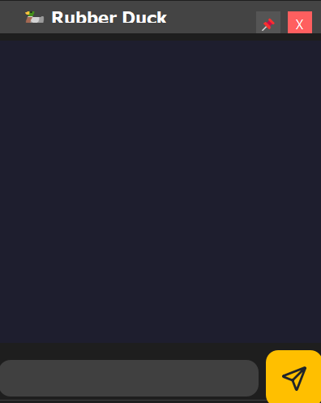

# 🦆 RubberDuckChat

**RubberDuckChatApp** is a fun and interactive desktop application designed for developers who enjoy rubber duck debugging. This app simulates a virtual rubber duck that responds with quacks and emojis, providing a light-hearted and humorous companion during coding sessions. The app is built using PyQt5 and features a custom, frameless window that can be pinned on top of other windows.

## ✨ Features

- **Customizable Quacks**: The duck responds with a variety of quack phrases, making each interaction unique.
- **Emoji Responses**: Depending on certain keywords, the duck responds with appropriate emojis and quacks to match the sentiment.
- **Frameless Window**: The app uses a custom title bar, giving it a sleek, modern look.
- **Pin Functionality**: The window can be pinned to stay on top of other applications.
- **Draggable Window**: The window can be moved around the screen by dragging the title bar.

## 🖼️ Screenshot




## 📦 Installation

### Prerequisites

- Python 3.x
- PyQt5

### Installation Steps

1. **Clone the repository**:
    ```bash
    git clone https://github.com/thorc04/RubberDuckChat.git
    cd RubberDuckChatApp
    ```

2. **Install the required dependencies**:
    ```bash
    pip install PyQt5
    ```

3. **Run the application**:
    ```bash
    python rubber_duck_chat_app.py
    ```

🚀 Usage
Sending a Message: Type your message in the input box and press Enter or click the send button (paper airplane icon). The duck will respond with a quack or an emoji response based on your message.
Pinning the Window: Click the pin icon (📌) on the title bar to toggle whether the window stays on top of other windows.
Closing the App: Click the X button on the title bar to close the application.

🔧 Customization
Quack Phrases
The app comes with a list of predefined quack phrases. You can customize or add new phrases in the quack_phrases list:

```python
self.quack_phrases = [
     "Quack! Quack quack.", "Quack. 😎", "Quaaack. 😠",
     "QuaCK qUacK!", "Qu-qu-qu-quack!", "Quaaaack... qu-quack.",
     "Qu-quack. 💨", "Quack!", "Quack Quack", "Quack!", 
     "Quack!!!", "Quaaaack", "Quack Quack Quack", "QUACK!!!!",
     "Quackity quack!", "Quack Quack... Quack?", "Quack! Quack! Quack!",
     "Quaaaack Quack.", "Quack-a-doodle-doo!", "Quack-a-lackin'!",
     "Quaaaack, quack-quack.", "QUA-QUACK!", "Quack attack!", 
     "Quack quack quack, quack quack.", "QUACK!! Quack quack quack!",
     "QUAAAACK!!!", "Quack... 🦆", "Quack-a-lot!", "Quack quack. 😏",
     "Quack-quack-quack-quack!", "Quack? Quack! Quack.", "Quack... Quack?"
]
```

Emoji Responses
The app detects certain keywords in the user’s message and responds with a relevant emoji and quack. You can modify or extend these responses in the emoji_responses dictionary:

```python
self.emoji_responses = {
     "love": "Quack Quack! 💖",
     "cute": "Quack! 😊",
     "sad": "Quack... 😢",
     "angry": "QUACK! 😠",
     "thanks": "Quack Quack! 🙏",
     "excited": "Quaaaack! 🎉",
     "happy": "Quack Quack! 😁",
     "surprised": "Quack?! 😲",
     "confused": "Quack? 🤔",
     "tired": "Quaaack... 😴",
     "cool": "Quack. 😎",
     "funny": "Quack Quack! 😂",
     "thinking": "Quack... 💭",
     "celebrate": "Quack Quack! 🎊",
     "thumbsup": "Quack Quack! 👍",
     "thumbsdown": "Quack... 👎",
     "clap": "Quack Quack! 👏",
     "smile": "Quack Quack! 😊",
     "wink": "Quack! 😉",
     "bored": "Quack... 😐"
}
```

🤝 Contributing
Contributions are welcome! Please feel free to submit a Pull Request or open an issue to discuss any improvements or suggestions.

📄 License
This project is licensed under the MIT License. See the LICENSE file for more details.

🙏 Acknowledgments
PyQt5: For providing the powerful GUI toolkit that made this application possible.
Rubber Duck Debugging: The concept that inspired this fun and helpful coding companion! 